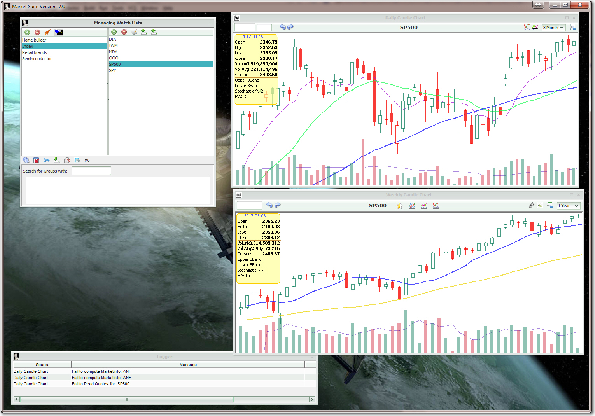

# Under construction

<b>Market Suite</b> is a Java based software created for the purpose of 
collecting, organizing and analyzing stock market data presented in a desktop
MDI window.

This repository contains only the source code tree. More work to be done 
to make it deployable to PC or MAC.

 
